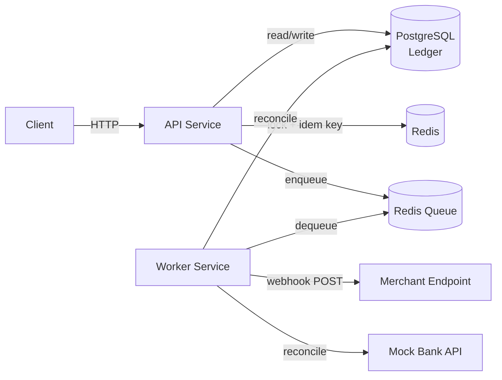

# PayLedger — Technical Design Document

2026-09-18&#32;

## Overview & Goals

PayLedger is a backend payment gateway and ledger system that simulates real-world payment processing. The goal is to demonstrate financial correctness under concurrency — idempotency, atomicity, auditability — not just CRUD.

Naive payment APIs risk double-charges on retried requests, unauditable balance mutations, and silent data loss on failed webhook deliveries. PayLedger addresses each with a specific design pattern, detailed below.

This document covers: system architecture, data model, four core flows (idempotent payment processing, UPI-style MDR fee calculation, webhook delivery, reconciliation), API design, Docker/CI-CD setup, security, and testing strategy.

## System Architecture

Four services, each in its own container:



Request flow for a payment: client sends `POST /payments` with an idempotency key → API checks Redis for that key → if unseen, acquires a per-account lock, writes the debit/credit pair to Postgres in one transaction, releases the lock, caches the response → enqueues a webhook job → returns 201.

## Tech Stack

| Layer | Choice | Why |
| --- | --- | --- |
| API | Node.js + Express + TypeScript | Matches existing backend stack; async/non-blocking I/O suits webhook fan-out |
| Ledger DB | PostgreSQL | ACID transactions for double-entry correctness; row-level locking (`SELECT FOR UPDATE`) |
| Cache / Locks | Redis | Idempotency key cache (TTL-based) + distributed locks (`SET NX PX`) |
| Queue | Redis Streams or BullMQ | Webhook delivery jobs, reconciliation jobs |
| Containerization | Docker + docker-compose | Reproducible multi-service local/dev environment |
| CI/CD | GitHub Actions | Lint, typecheck, test, build, push, deploy on every merge |
| Testing | Jest + Supertest | Unit tests + integration tests against live containers |

## Core Flow: Idempotent Payment Processing

1. Client sends `POST /payments` with header `Idempotency-Key: <client-generated-uuid>`.
2. API checks Redis: `GET idem:<key>`. Hit → return the cached response immediately (same status, same body), no reprocessing.
3. Miss → API acquires a distributed lock on the payer's account: `SET lock:acct:<id> <token> NX PX 5000`. Lock held → retry with backoff (max 3 attempts) or return `409 Conflict`.
4. Inside the lock, in a single Postgres transaction: verify payer balance ≥ amount, compute the MDR fee (next section), insert the debit/credit `ledger_entries` pair, insert the `transactions` row with `status='completed'`, commit.
5. Release the lock (`DEL` only if the token matches — avoids releasing a lock acquired by a different request after expiry).
6. Cache the response under `idem:<key>` in Redis with a 24h TTL.
7. Enqueue a webhook job for the merchant.

This guarantees: same idempotency key → same result always; concurrent requests on the same account → serialized, never a lost update.

## Core Flow: MDR Fee Calculation

Mirrors India's UPI MDR framework effective October 15, 2026:

```
function calculateMDR(amountMinor, payeeAccountType):
    if payeeAccountType == 'P2P':
        return 0
    if payeeAccountType == 'P2PM_MICRO' and payee.monthlyVolume <= 100000_00:  # ₹1 lakh cap
        return 0
    if amountMinor <= 2000_00:  # ₹2,000 in paise
        return 0
    fee = amountMinor * 0.004
    return min(fee, 300_00)  # ₹300 cap
```

The fee is computed inside the same DB transaction as the payment (step 4 of the previous flow) so it's atomic with the transfer, never a separate out-of-band charge. A third ledger entry (fee credited to the platform account) is written alongside the payer/payee pair, keeping the books balanced three ways: payer debit, payee credit, platform fee credit.

## Core Flow: Webhook Delivery System

Worker dequeues jobs from a Redis-backed queue (BullMQ or Redis Streams):

1. POST the transaction status to the merchant's registered webhook URL with a signed payload (HMAC-SHA256 over the body, shared secret per merchant).
2. Success (2xx) → mark `webhook_deliveries.status = 'delivered'`.
3. Failure or timeout → increment `attempt_count`, compute next retry with exponential backoff + jitter: `delay = min(2^attempt * 1000ms, 5min) + random(0, 500ms)`.
4. After 8 failed attempts (roughly a few hours of retrying) → move to `dead_letter` status; surfaced in an admin view for manual retry or investigation.

Delivery is at-least-once, not exactly-once — merchants are expected to dedupe on `transaction_id` in the payload (documented in the API section).

## Core Flow: Reconciliation Job

Runs on a schedule (every 15 minutes, cron-triggered worker process):

1. Pull all `transactions` completed since the last run.
2. For each, verify `SUM(ledger_entries.amount_minor)` for that `transaction_id` equals 0 (the double-entry invariant).
3. Compare the ledger's view of each transaction against a mock external "bank" API — a stubbed service simulating settlement confirmation.
4. Any mismatch → write a `reconciliation_exceptions` row (transaction\_id, expected, actual, detected\_at) and alert, rather than auto-correcting. Financial discrepancies get human review, not silent fixes.

This is the piece that demonstrates the project understands payments aren't "fire and forget" — money movement needs continuous verification against ground truth.

## Core Flow: Split Payment (Structuring Pattern Demo)

Educational feature demonstrating multi-part payment atomicity and the transaction-structuring pattern MDR frameworks are designed to discourage. Not intended as a real fee-avoidance feature — this same flow doubles as the exact pattern a fraud/velocity check should later detect.

1. Consumer initiates a payment of ₹5,500 to a merchant.
2. API computes the MDR that would apply as a single transaction and quotes it alongside the option to split.
3. On confirmation, the amount is divided using an even split — N parts, each ≤ ₹1,999 (e.g. ₹5,500 → ₹1,834 + ₹1,833 + ₹1,833 for N=3).
4. All N sub-payments are submitted together as one batch, no staggering.
5. Orchestration is all-or-nothing via a saga/compensation pattern, not a single DB transaction — each sub-payment runs through the full independent payment rail (its own idempotency key, lock, and ledger entries). If any sub-payment fails, the orchestrator reverses the ones that already succeeded with compensating offset entries rather than a raw rollback.

**Data model additions:**

- `transactions.is_split` (boolean) — flags a transaction as the parent of a split batch.
- `split_payments` table: id, parent\_transaction\_id (FK → transactions), sequence, amount\_minor, status, created\_at — one row per sub-payment in the batch.

**API:** parked — to be designed once the code structure is settled.

## API Design

| Method | Path | Purpose |
| --- | --- | --- |
| POST | /accounts | Create a payer/payee/merchant account |
| POST | /payments | Create a payment (requires `Idempotency-Key` header) |
| GET | /payments/:id | Fetch a transaction's status and ledger entries |
| GET | /accounts/:id/balance | Current balance, derived from ledger, not stored mutable state |
| GET | /accounts/:id/ledger | Paginated ledger entry history for an account |
| POST | /webhooks/register | Merchant registers a webhook URL and gets a signing secret |
| GET | /admin/reconciliation-exceptions | List unresolved reconciliation mismatches |

All amounts in request/response bodies are integers in minor units (paise), never floats — avoids classic floating-point rounding bugs in money math.

## Docker & Infrastructure

Multi-stage `Dockerfile` for the API/worker (shared base, different entrypoints):

```dockerfile
FROM node:20-alpine AS build
WORKDIR /app
COPY package*.json ./
RUN npm ci
COPY . .
RUN npm run build

FROM node:20-alpine AS production
WORKDIR /app
COPY --from=build /app/dist ./dist
COPY --from=build /app/node_modules ./node_modules
CMD ["node", "dist/index.js"]
```

`docker-compose.yml` services: `api`, `worker`, `postgres`, `redis` — each with a `healthcheck` (`pg_isready` for Postgres, `redis-cli ping` for Redis). `api` and `worker` use `depends_on: condition: service_healthy` so they never start against a database that isn't ready yet.

## CI/CD Pipeline

GitHub Actions, `.github/workflows/ci.yml`, stages gated in sequence:

1. **Lint + typecheck** — `eslint .` and `tsc --noEmit`.
2. **Unit tests** — Jest, mocking Postgres/Redis.
3. **Integration tests** — `docker compose up -d`, wait for healthchecks, run Supertest against the live stack (real Postgres transactions, real Redis locks), then `docker compose down`. This stage is what actually proves idempotency and locking work, not just that the logic compiles.
4. **Build & push** — on merge to `main` only: build the production image, tag with the git SHA, push to GHCR.
5. **Deploy** — trigger a deploy (Railway, Render, or Fly.io) pointing at the newly pushed image tag.

## Security Considerations

- Webhook payloads signed with HMAC-SHA256; merchants verify the signature before trusting a delivery.
- Idempotency keys are client-supplied but scoped per API key — one merchant can't collide with another's key.
- All monetary values are integers in minor units — never floats, never client-supplied fee amounts (fees are always server-computed).
- Rate limiting per API key on `/payments` to prevent abuse.
- Secrets (DB credentials, webhook signing keys) injected via environment variables or Docker secrets, never committed.
- Audit trail: `ledger_entries` are append-only — no `UPDATE` or `DELETE` permitted at the application layer; corrections happen via new offsetting entries, never mutation.

## Testing Strategy

- **Unit tests** (Jest): MDR fee calculation across all tiers and boundaries, ledger balance math, webhook signature generation — pure functions, no I/O.
- **Integration tests** (Jest + Supertest, run against the live docker-compose stack in CI): full `/payments` flow including duplicate idempotency-key requests (asserting an identical response and a single ledger entry pair), concurrent requests on the same account (asserting no lost updates), webhook retry behavior against a mock failing endpoint.
- **Reconciliation tests**: seed intentional mismatches against the mock bank API and assert they're caught and logged as exceptions.

## Roadmap

- Multi-currency support (currently single-currency per account)
- Refunds/reversals as offsetting ledger entries rather than deletions
- Rate-limited public API with per-merchant dashboards
- Real bank sandbox integration (e.g. a UPI test environment) in place of the mock bank API
- Admin UI for reviewing reconciliation exceptions and dead-lettered webhooks
